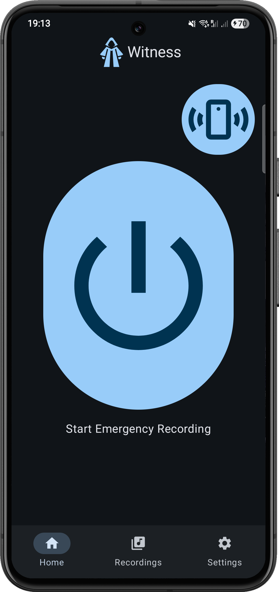
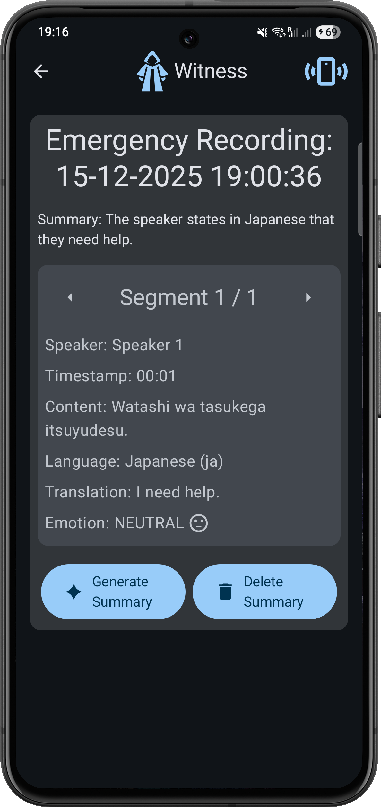
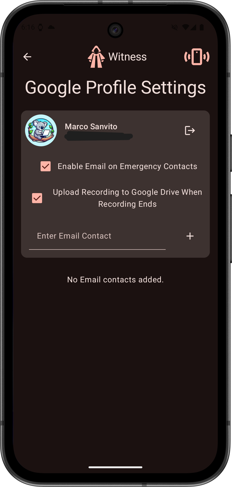
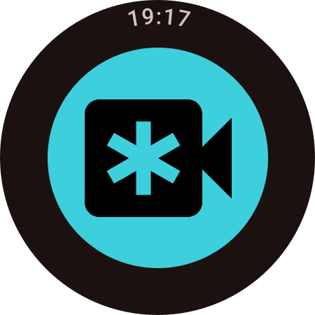
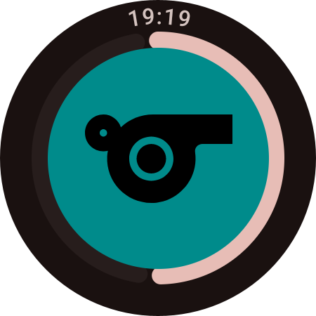

[# Witness

> Final project for the *Android Programming Project (APP)* – Università della Svizzera italiana, Fall 2025
---

**Witness** is a mobile and wearable application developed for the *Mobile and Wearable Computing* course (Università della Svizzera italiana, Fall 2025).  
The project provides a personal security system to assist users in emergency or unsafe situations.

## Team
- [Desantis Amedeo](https://github.com/AmedeoDesantis)
- [Lesinigo Simone](https://github.com/simone-lesinigo)
- [Sanvito Marco](https://github.com/koalas11)

## How to build & run

### Prerequisites

- Android Studio Otter (version 2025.2.2) or later
- JDK 17 or later
- An Android device or emulator with Google Play Services (for GPS)
- A Wear OS device or emulator (for wearable companion app)
- Google account for Gmail and Drive integration (optional)
- Gemini API Key for LLM features (optional)

Note: To use the Google Integration features (Gmail, Drive), you need to contact one of the team members to obtain access.

### Building and running the app

1. Clone the repository:
   ```bash
   git clone https://github.com/koalas11/Witness.git
   ```

2. Open the project in Android Studio.
3. Sync the Gradle files to download dependencies.
4. Configure the Gemini API key (if using LLM features):
    - Create a `local.properties` file in the root directory.
    - Add the following line:
      ```geminiApiKey=YOUR_GEMINI_API_KEY```
    - Replace `YOUR_GEMINI_API_KEY` with your actual API key.
5. Connect your Android device or start an emulator.
6. Select the desired run configuration (mobile app or wearable app).
7. Click the "Run" button to build and deploy the app.
8. Follow the on-screen instructions to set up the app and grant necessary permissions (microphone, location, SMS, etc.).

If also running the Wear OS companion app, ensure that your wearable device is paired with your phone and follow similar steps to build and run the wearable app.

## Key Features
- Continuous **audio** and **GPS location** recording when activated
- Automatic **SMS and email alerts** sent to trusted contacts every 5 minutes with updated location
- **Immediate loud alarm sound** to draw attention and discourage threatening behavior
- Data stored **locally** and on **Google Drive** to ensure persistence and availability
- Map visualization of recorded locations and playback of captured audio
- Audio processing with **LLM** for segmentation, summarization, emotion detection, and translation
- Companion app for **Wear OS** to start/stop recording and trigger alarms remotely

## Sensors & Actuators
- **Sensors:** Microphone, GPS, Fingerprint Scanner / FaceID
- **Actuators:** Vibration, Speaker

## Code architecture overview

### High-level overview
- Purpose: share UI, domain and data logic across platforms with platform specific implementations.
- Main components: shared KMP modules (UI, domain & data), platform modules/services (adapters), and modules (platform-specific).

### Architecture and layers
- **UI layer**
    - Jetpack Compose for shared UIs.
    - Observes ViewModel state and sends user events to ViewModels.
- **ViewModel layer**
    - Exposes StateFlows to UI, collects Flows from UseCases/Repositories.
    - Responsible for UI state orchestration and thin transformations.
    - Created through factories that obtain dependencies from the AppContainer (no global singletons).
- **UseCase / Domain layer**
    - Encapsulates business processes and orchestration (e.g., emergency recording, contact notifications, Google integration, LLM summarization).
    - Coordinates platform services, repositories, and lower-level APIs.
- **Repository layer**
    - Abstracts concrete data sources (Room, DataStore, network).
    - Returns `Result<T>` wrappers and `Flow<T>` streams; maps exceptions into unified error types.
- **Data sources**
    - Room DB for recording metadata (entities + DAOs).
    - DataStore (serializer-backed) for settings, contacts, and OAuth/profile.
    - Ktor HTTP clients for network and authenticated Google APIs.
- **Platform services / modules (adapters)**
    - Platform-specific features implemented as modules (interface + platform implementation).
    - Injected via the AppContainer into UseCases and other consumers.

### Services / Modules (design & responsibilities)
Services (modules) are first-class adapters that provide platform behavior required by domain logic. They isolate platform code and make business logic testable.

Common modules found in the project (conceptual list):
- `VibrationModule` — device vibration control (short/long patterns).
- `SoundAlertModule` — play system sounds/alerts.
- `AudioRecorderModule` — record audio (start/stop, file management).
- `AudioPlayerModule` — playback control for recorded audio.
- `GeoRecordingModule` — obtain current location and manage GPS path collection.
- `RecordingServiceHandler` — start/stop foreground recording service (platform-specific lifecycle).
- `EmergencyContactModule` — send SMS/emails or invoke contact channels.
- `Google integration services` — authenticated calls for Gmail, Drive, Profile, token refresh.
- `LLM/Gemini wrapper` — call LLM endpoints for summarization and return structured results.

Design notes:
- Each module exposes a minimal interface consumed by UseCases.
- Platform implementations live in platform source sets and are wired in the platform `AppContainer`.
- UseCases never call platform APIs directly; they call module interfaces.

### Dependency Injection (App container pattern)
- `AppContainer` (interface) defines app-level dependencies (repositories, HTTP clients, use cases).
- `AppContainerImpl` wires DataStore, Room DB, Ktor clients, repositories and UseCases.
- `PlatformAppContainer` extends `AppContainer` with platform modules (vibration, audio, geo, service handler).
- Each platform (Android, iOS, Wear) provides a concrete container (e.g., `AndroidAppContainer`) that supplies platform module implementations.
- Consumers (ViewModels, UseCases) get dependencies from the container via factory/creation-extras (no global mutable singletons).

### Data flow example: emergency recording
1. UI triggers `startEmergencyRecording()` on ViewModel.
2. ViewModel calls `EmergencyRecordingUseCase.startEmergencyRecording()`.
3. UseCase reads settings from `SettingsRepository` (DataStore), triggers `VibrationModule`, requests location via `GeoRecordingModule`, and starts foreground recording via `RecordingServiceHandler`.
4. UseCase uses `EmergencyContactsRepository` and `EmergencyContactModule` (or `GoogleIntegrationUseCase`) to notify contacts by SMS/email periodically if configured.
5. Repositories persist metadata to Room (DAO); LLM summary calls (via `GeminiApiUseCase`) produce summaries saved back by repositories.
6. State and events flow back to ViewModel via `Flow`/`StateFlow` and are observed by the UI.

### Error handling
- Layers return `Result<T>` and `ResultError` (sealed) types to normalize success/error handling.
- Exceptions are caught at repository/use case boundaries and mapped to `ResultError`.
- ViewModels expose loading / success / error states to the UI via sealed interfaces.

### Simple diagram
```
[ UI (Compose) ]
            ↓
[ ViewModel (StateFlows) ]
            ↓
[ UseCase / Domain logic ] 
            ↓
[ Repositories (Result / Flow) ] 
            ↓
[ Data sources: Room / DataStore / Ktor ]
            ↑
[ Platform Modules / Services (vibration, audio, geo, contacts) ]
```

## Screenshots

### Mobile App

<div style="text-align:center;">
  
  
</div>

<div style="text-align:center;">
  
  
</div>

### Wearable App

<div style="text-align:center;">
  
  
</div>
